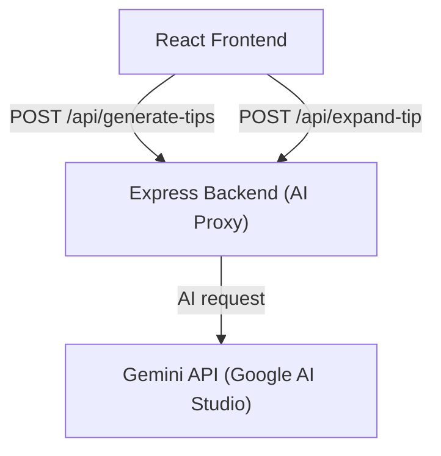
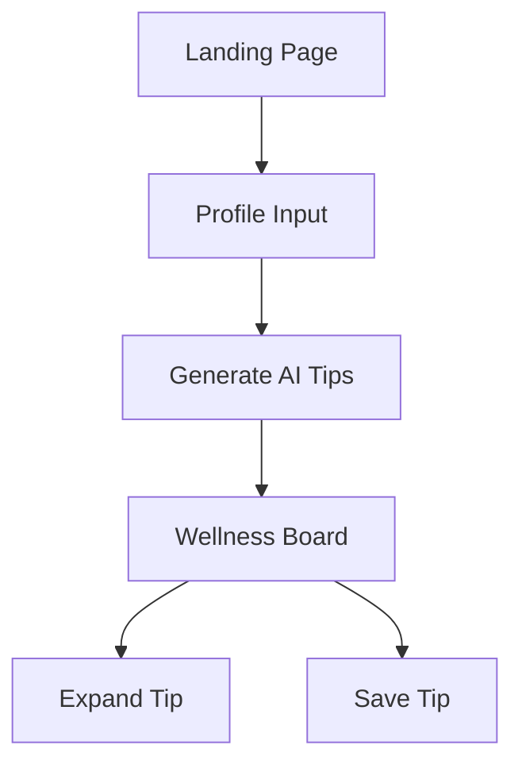
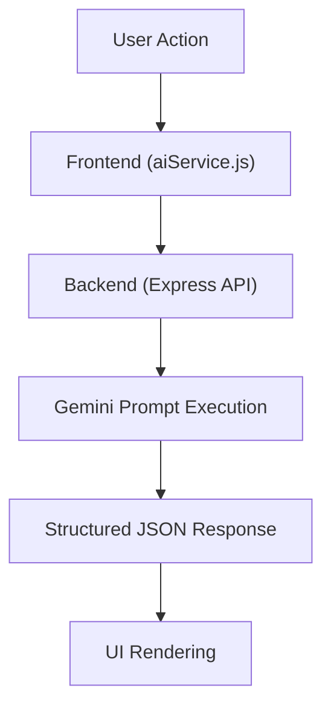

# 🧘 AI-Generated Wellness Recommendation Board

A modern AI-powered wellness web application that generates personalized health and lifestyle recommendations based on user profiles. The product emphasizes calm UX, structured AI outputs, and production-ready async handling.

## 1. Project Setup & Demo

### 🌐 Web (Local Development)

Frontend:
    
    cd frontend
    npm install
    npm run dev

Backend:

    cd server
    npm install
    node index.js

- Frontend runs on: http://localhost:5173  
- Backend (AI proxy) runs on: http://localhost:8080  

### 🚀 Deployed Demo

The application is deployed and accessible via https://wellness-board.vercel.app

### 🎥 Demo Walkthrough

A screen recording demonstrates:

https://drive.google.com/file/d/1HIz5u2sbU6qE-cUftPVM1tqwlgedPKSN/view?usp=sharing

- Profile creation  
- AI-generated tips  
- Tip expansion  
- Refresh / regenerate flow  
- Saving and viewing favorite tips  

## 2. Problem Understanding

The objective is to design a personalized wellness recommendation system that:

- Collects basic user profile inputs (age, gender, goal)  
- Generates AI-curated wellness tips  
- Allows users to explore, expand, and save recommendations  
- Handles loading, regeneration, and error states gracefully  

### Assumptions

- The system provides general wellness guidance only (no medical advice)  
- AI outputs must be safe, non-diagnostic, and user-friendly  
- User data is stored locally, without authentication  
- Initial development supports mock data, later replaced by live AI responses  

## 3. AI Prompts & Iterations

### Initial Prompt

    Generate wellness tips for better sleep.

**Issues observed:**

- Inconsistent formatting  
- Overly verbose responses  
- Hard to reliably parse in UI  

### Refined Prompt

    You are a calm, supportive wellness assistant.
    
    Return ONLY valid JSON.
    Generate exactly 5 wellness tips based on the user profile.
    Each tip must include: id, title, short description, icon, and category.
    Avoid medical or diagnostic language.

### Tip Expansion Prompt

    Expand the selected wellness tip into a warm explanation
    and return exactly 3 actionable steps in JSON format.

These refinements ensure deterministic output, stable parsing, and consistent user experience.

## 4. Architecture & Code Structure

### High-Level Architecture

### Project Structure

    /frontend
     ├── src/
     │   ├── components/
     │   ├── pages/
     │   ├── context/
     │   ├── services/
     │   │    └── aiService.js
     │   └── App.jsx
     └── index.html

    /server
     ├── index.js
     ├── package.json
     └── .env

### State & Data Flow

- Global state is managed using React Context  
- `aiService.js` abstracts all AI-related API calls  
- Backend acts as a secure Gemini API proxy  
- Favorites are persisted in localStorage  

## 5. Application Workflow Diagrams

### User Flow

### AI Request Flow

## 6. Screenshots / Screen Recording

Screenshots and screen recordings are provided covering:

- Landing page  
- Profile capture  
- Tips board  
- Tip expansion view  
- Saved tips section  
- Loading and error states  

## 7. Known Issues / Improvements

### Known Issues

- Limited daily request quota from the AI provider  
- No authentication or cloud persistence  
- AI responses can vary slightly across refreshes  

### Future Improvements

- Server-side caching to reduce AI calls  
- User accounts with cloud persistence  
- Multi-goal wellness plans  
- Offline support  
- Analytics for recommendation engagement  

## 8. Bonus Work

- Editorial, Awwwards-inspired UI design  
- Smooth micro-interactions and transitions  
- Skeleton loaders for all async states  
- Rate-limited backend to protect AI quota  
- Retry and regenerate flows  
- Font consistency across environments  
- Production-ready prompt design  

## Final Notes

This project demonstrates real-world frontend and backend integration, thoughtful AI prompt engineering, and a strong focus on user experience and code quality aligned with modern product engineering standards.
